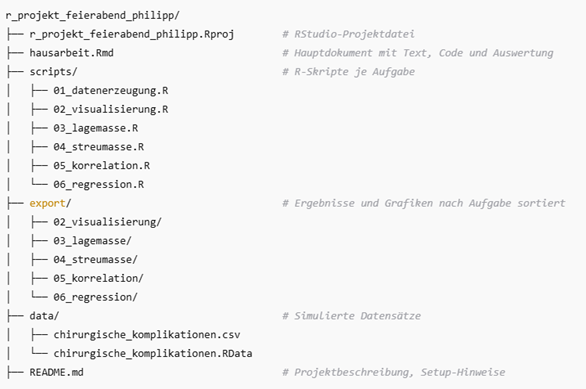

# Einleitung

Diese Hausarbeit analysiert simulierte Daten zu **Operationsdauer**, **Blutverlust** und **Komplikationsrisiko** bei chirurgischen Eingriffen mit dem Statistikprogramm **R**. Ziel ist es, statistische Größen wie Lage- und Streumaße zu berechnen, Zusammenhänge zu erkennen und medizinisch zu interpretieren.

Ein gutes Verständnis solcher Einflussfaktoren ist entscheidend, um chirurgische Risiken besser einschätzen und präventive Maßnahmen planen zu können.

------------------------------------------------------------------------

# Verzeichnisstruktur



------------------------------------------------------------------------

# Aufgabe a) Bedeutung der Daten im Studienkontext

## Fachlicher Hintergrund

Die Analyse basiert auf simulierten OP-Daten und ist relevant für Studiengänge wie **Angewandte Gesundheitswissenschaften**, **Gesundheitsökonomie** oder **Medizinische Informatik**. Komplikationen nach chirurgischen Eingriffen sind ein ernstzunehmender klinischer Parameter. Je nach Eingriff kann die **Operationsdauer** (z. B. längere OPs bei komplexeren Fällen), der **intraoperative Blutverlust** oder das **individuelle Komplikationsrisiko** stark variieren.

Ziel ist es, durch statistische Analysen ein besseres Verständnis dieser Variablen zu entwickeln, was wiederum z. B. OP-Teams bei Entscheidungen zur Risikoeinschätzung unterstützen kann.

## Statistische Begriffe im Projektkontext

-   **Merkmalsträger:** Ein einzelner chirurgischer Eingriff
-   **Merkmale:**
    -   *Operationsdauer* (in Minuten)
    -   *Blutverlust* (in Millilitern)
    -   *Komplikationsrisiko* (Skalenwert zwischen 30–300)
-   **Merkmalsausprägung:** Ein konkreter Wert pro Merkmal, z. B. 120 Minuten, 180 ml, Risikoindex 210
-   **Skalenniveau:** Alle drei Merkmale sind **metrisch skaliert**. Daher sind statistische Berechnungen wie Mittelwert, Varianz oder Regressionsanalyse sinnvoll.
-   **Hinweis zur Skala Komplikationsrisiko:**\
    Der Wert "Komplikationsrisiko" ist ein **Indexwert** zur besseren Vergleichbarkeit. Er soll *nicht* als realer Prozentwert interpretiert werden, sondern stellt ein relatives Maß zur Einschätzung des Risikos dar. So kann z. B. "180" als doppelt so risikobehaftet wie "90" betrachtet werden.

------------------------------------------------------------------------

# Vorbereitung: R-Pakete installieren und laden

## 1. Pakete festlegen

```{r define_packages}
pakete <- c(
  "here",
  "ggplot2",
  "ggbeeswarm",
  "reshape2",
  "officer",
  "flextable",
  "dplyr",
  "psych",
  "gridExtra",
  "apaTables"
)

# Überprüfe, ob die Pakete installiert sind, und installiere sie, falls nicht
for (pkg in pakete) {
  if (!requireNamespace(pkg, quietly = TRUE)) {
    install.packages(pkg)
  }
  library(pkg, character.only = TRUE)
}
```

## 2. Fehlende Pakete installieren

```{r install_packages}
fehlen <- pakete[!(pakete %in% installed.packages()[, "Package"])]
if (length(fehlen) > 0) {
  install.packages(fehlen)
}
```

## 3. Pakete laden

```{r load_packages}
lapply(pakete, function(pkg) {
  library(pkg, character.only = TRUE)
})
```

## 4. Session-Info anzeigen

```{r session_info}
sessionInfo()
```

------------------------------------------------------------------------

# Datenerzeugung mit R

Zu Beginn der Analyse wird ein Datensatz mit 500 simulierten Beobachtungen erzeugt. Jede dieser Beobachtungen repräsentiert einen chirurgischen Eingriff, und der Datensatz umfasst die Variablen *Operationsdauer*, *Blutverlust* und *Komplikationsrisiko*, die zufällig im Bereich von 30 bis 300 erzeugt wurden. Diese Auswahl stellt sicher, dass alle Variablen denselben Wertebereich abdecken, was eine vergleichbare Analyse ermöglicht.

### Code-Erklärung:

```{r datensatz_erzeugen}
source(here::here("scripts", "01_datenerzeugung_v1.R"))
```

-   **`source()`**: Mit dieser Funktion wird das R-Skript `01_datenerzeugung_v1.R` aufgerufen, das die Datenerstellung übernimmt. Das Skript erzeugt drei Zufallsvariablen:
    -   **`Operationsdauer`**: Zufallszahlen im Bereich von 30 bis 300, die die Dauer der Operation in Minuten repräsentieren.
    -   **`Blutverlust`**: Zufallszahlen im selben Bereich, die den Blutverlust in Millilitern beschreiben.
    -   **`Komplikationsrisiko`**: Ein weiteres zufällig generiertes Maß für das Risiko von Komplikationen, ebenfalls im Bereich von 30 bis 300.
-   **Speicherung der Daten**: Die erzeugten Daten werden sowohl in der `.RData`- als auch in der `.csv`-Datei gespeichert, um die Weiterverwendung zu erleichtern.

``` r
save(daten, file = dateiname_rdata)
write.csv(daten, file = dateiname_csv, row.names = FALSE)
```

------------------------------------------------------------------------

# Aufgabe b) Grafische Darstellung

Um die Verteilung der Variablen visuell darzustellen, werden verschiedene Diagrammtypen verwendet. Insbesondere werden Histogramme und Beeswarm-Plots eingesetzt, um die Häufigkeit der Daten sowie die Verteilung innerhalb der Variablen darzustellen.

### Code-Erklärung:

```{r visualisierung}
source(here::here("scripts", "02_visualisierung_v3.R"))
```

-   **`source()`**: Hier wird das Skript `02_visualisierung_v3.R` aufgerufen, das für die grafische Darstellung verantwortlich ist. Im Skript werden die folgenden Schritte durchgeführt:

1.  **Histogramme**:

    ``` r
    ggplot(daten, aes(x = Operationsdauer)) +
      geom_histogram(binwidth = 20, fill = "lightblue", color = "black") +
      labs(title = "Histogramm: Operationsdauer", x = "Minuten", y = "Frequenz") +
      xlim(30, 300) +
      theme_white_report()
    ```

    -   **`ggplot()`**: Diese Funktion wird verwendet, um das Histogramm für die *Operationsdauer* zu erstellen. Es wird ein Histogramm mit einer Binbreite von 20 erzeugt. Das Aussehen des Diagramms wird mit der Funktion **`theme_white_report()`** angepasst.
    -   **`geom_histogram()`**: Diese Funktion fügt die Histogrammdaten zum Diagramm hinzu.
    -   **`labs()`**: Dient der Beschriftung der Achsen und des Titels des Diagramms.

2.  **Beeswarm-Plots**:

    ``` r
    ggplot(daten_long, aes(x = Merkmal, y = Wert)) +
      geom_beeswarm(priority = "density", color = "darkblue", size = 1.5, alpha = 0.6) +
      labs(title = "Beeswarmplot: Vergleich der Merkmale", x = "Merkmal", y = "Wert (30–300)") +
      ylim(30, 300) +
      theme_white_report()
    ```

    -   **`geom_beeswarm()`**: Diese Funktion erzeugt die Beeswarm-Plots. Die Punkte werden dicht nebeneinander angeordnet, wobei die Dichte der Punkte visualisiert wird. Dies ermöglicht eine übersichtliche Darstellung der Verteilung der Werte in den verschiedenen Variablen.

### Ausgabae der Histogramme und Beeswarm-Plots:

```{r, echo=FALSE, out.width="80%", fig.align='center'}
knitr::include_graphics("export/02_visualisierung/hist_operationsdauer.png")
knitr::include_graphics("export/02_visualisierung/hist_blutverlust.png")
knitr::include_graphics("export/02_visualisierung/hist_komplikationsrisiko.png")
knitr::include_graphics("export/02_visualisierung/beeswarm_operationsdauer.png")
knitr::include_graphics("export/02_visualisierung/beeswarm_blutverlust.png")
knitr::include_graphics("export/02_visualisierung/beeswarm_komplikationsrisiko.png")
knitr::include_graphics("export/02_visualisierung/beeswarm_alle_merkmale.png")

```

------------------------------------------------------------------------

# Aufgabe c) Lagemaße

In dieser Aufgabe werden die Lagemaße (Mittelwert, Median und Modus) für jede Variable berechnet. Lagemaße beschreiben die zentrale Tendenz einer Verteilung und helfen, den "typischen" Wert einer Variablen zu bestimmen.

### Code-Erklärung:

```{r lagemasse}
source(here::here("scripts", "03_lagemasse_v3.R"))
```

-   **`source()`**: Das Skript `03_lagemasse_v3.R` wird hier aufgerufen, um die Berechnungen der Lagemaße durchzuführen. Das Skript verwendet die folgenden Schritte:

1.  **Berechnung des Mittelwerts, Medians und Modus**:

    ``` r
    mean_ops <- mean(daten$Operationsdauer)
    median_ops <- median(daten$Operationsdauer)
    modus_ops <- modus(daten$Operationsdauer)
    ```

    -   **`mean()`**: Berechnet den Mittelwert der *Operationsdauer*.
    -   **`median()`**: Berechnet den Median, also den mittleren Wert der sortierten Daten.
    -   **`modus()`**: Eine benutzerdefinierte Funktion, die den Modus, also den häufigsten Wert, berechnet.

2.  **Darstellung der Lagemaße in einem Diagramm**:

    ``` r
    ggplot(daten, aes(x = .data[[var_name]])) +
      geom_histogram(aes(y = ..density..), binwidth = 20, fill = "gray80", color = "black") +
      geom_vline(xintercept = m, color = "blue", linetype = "dashed", linewidth = 1) +
      geom_vline(xintercept = med, color = "red", linetype = "solid", linewidth = 1) +
      geom_vline(xintercept = mod, color = "green", linetype = "dotted", linewidth = 1)
    ```

    -   Hier wird ein Histogramm erstellt, in dem die berechneten Lagemaße (Mittelwert, Median und Modus) als vertikale Linien angezeigt werden.

### Ausgabe der Lageparameter in englisch:

```{r, echo=FALSE, out.width="80%", fig.align='center'}
knitr::include_graphics("export/03_lagemasse/lagemasse_duration_en.png")
knitr::include_graphics("export/03_lagemasse/lagemasse_bloodloss_en.png")
knitr::include_graphics("export/03_lagemasse/lagemasse_risk_en.png")
```

### Ausgabe der Lageparameter in deutsch:

```{r, echo=FALSE, out.width="80%", fig.align='center'}
knitr::include_graphics("export/03_lagemasse/lagemasse_duration_de.png")
knitr::include_graphics("export/03_lagemasse/lagemasse_bloodloss_de.png")
knitr::include_graphics("export/03_lagemasse/lagemasse_risk_de.png")
```

------------------------------------------------------------------------

# Aufgabe d) Streumaße

Streumaße wie die Standardabweichung, der Interquartilsabstand (IQR) und die mittlere absolute Abweichung (MAD) messen, wie weit die Daten von der zentralen Tendenz entfernt sind. Diese Maße geben Aufschluss darüber, wie variabel oder stabil die Werte innerhalb einer Variablen sind.

### Code-Erklärung:

```{r streumasse}
source(here::here("scripts", "04_streumasse_v4.R"))
```

-   **`source()`**: Das Skript `04_streumasse_v4.R` wird verwendet, um die Streumaße zu berechnen und darzustellen. Folgende Schritte sind enthalten:

1.  **Berechnung der Streumaße**:

    ``` r
    sd_ops <- sd(daten$Operationsdauer)
    var_ops <- var(daten$Operationsdauer)
    mad_ops <- mad(daten$Operationsdauer)
    ```

    -   **`sd()`**: Berechnet die Standardabweichung der *Operationsdauer*, was angibt, wie weit die einzelnen Werte im Durchschnitt vom Mittelwert abweichen.
    -   **`var()`**: Berechnet die Varianz, also die mittlere quadratische Abweichung der Werte vom Mittelwert.
    -   **`mad()`**: Berechnet die mittlere absolute Abweichung, die ein robustes Maß für die Streuung ist.

2.  **Visualisierung der Streumaße**:

    ``` r
    ggplot(df, aes(x = Maß, y = Wert, fill = Maß)) +
      geom_bar(stat = "identity", width = 0.5) +
      labs(title = paste("IQR & MAD:", var_label), y = "Wert") +
      theme_white_report()
    ```

    -   Hier werden die IQR- und MAD-Werte für jede Variable in einem Balkendiagramm dargestellt.

### Ausgabe des Boxplotes und der Balkendiagramme

```{r, echo=FALSE, out.width="80%", fig.align='center'}
knitr::include_graphics("export/04_streumasse/streumasse_boxplots_gesamt.png")
knitr::include_graphics("export/04_streumasse/iqr_mad_operationsdauer.png")
knitr::include_graphics("export/04_streumasse/iqr_mad_blutverlust.png")
knitr::include_graphics("export/04_streumasse/iqr_mad_komplikationsrisiko.png")
```

------------------------------------------------------------------------

# Aufgabe e) Korrelationen

Korrelationen beschreiben die Beziehung zwischen zwei Variablen. Ein positiver Korrelationskoeffizient zeigt an, dass ein Anstieg einer Variablen mit einem Anstieg der anderen Variablen verbunden ist.

### Code-Erklärung:

```{r korrelation}
source(here::here("scripts", "05_korrelation_v3.R"))
```

-   **`source()`**: Das Skript `05_korrelation_v3.R` wird aufgerufen, um die Korrelationen zwischen den Variablen zu berechnen und darzustellen.

1.  **Berechnung der Korrelationen**:

    ``` r
    cor_ops_blut <- cor(daten$Operationsdauer, daten$Blutverlust)
    cor_ops_komp <- cor(daten$Operationsdauer, daten$Komplikationsrisiko)
    cor_blut_komp <- cor(daten$Blutverlust, daten$Komplikationsrisiko)
    ```

    -   **`cor()`**: Berechnet den Korrelationskoeffizienten für jede Variablenpaarung.

2.  **Visualisierung der Korrelationen**:

    ``` r
    ggplot(daten, aes(x = .data[[xvar]], y = .data[[yvar]])) +
      geom_point(alpha = 0.5, color = "gray40") +
      geom_smooth(method = "lm", color = "blue", linewidth = 1, se = FALSE)
    ```

    -   **`geom_smooth()`**: Fügt eine lineare Regressionslinie hinzu, um die Korrelation zwischen den Variablen zu verdeutlichen.

### Ausgabe der Korrelationsdiagramme

```{r, echo=FALSE, out.width="80%", fig.align='center'}
knitr::include_graphics("export/05_korrelation/plot_ops_blut.png")
knitr::include_graphics("export/05_korrelation/plot_ops_komp.png")
knitr::include_graphics("export/05_korrelation/plot_blut_komp.png")
```

> **Hinweis:** Die Datei wird als `.docx`-Datei für die Hausarbeit-Ausarbeitung ausgegeben.

------------------------------------------------------------------------

Aufgabe f) Regressionsanalyse

Die Regressionsanalyse wird verwendet, um die Beziehung zwischen einer abhängigen und einer oder mehreren unabhängigen Variablen zu modellieren. In dieser Aufgabe wird untersucht, ob das Komplikationsrisiko durch den Blutverlust und die Operationsdauer vorhergesagt werden kann.

### Code-Erklärung:

```{r regression}
source(here::here("scripts", "06_regression_v2.R"))
```

-   **`source()`**: Das Skript `06_regression_v2.R` wird aufgerufen, um die Regressionsanalyse durchzuführen.

1.  **Erstellung eines Regressionsmodells**:

    ``` r
    model <- lm(Komplikationsrisiko ~ Blutverlust, data = daten)
    ```

    -   **`lm()`**: Führt eine lineare Regression durch, bei der das Komplikationsrisiko als abhängige Variable und der Blutverlust als unabhängige Variable verwendet werden.

2.  **Visualisierung der Regressionsgeraden**:

    ``` r
    ggplot(daten, aes(x = Blutverlust, y = Komplikationsrisiko)) +
      geom_point(alpha = 0.5, color = "gray40") +
      geom_smooth(method = "lm", color = "blue", se = TRUE)
    ```

    -   **`geom_smooth()`**: Visualisiert die lineare Regressionsgerade zusammen mit einem Konfidenzintervall (durch `se = TRUE`).

3.  **Ausgabe der Modellkoeffizienten**:

    ``` r
    summary(model)
    ```

    -   **`summary()`**: Gibt eine Zusammenfassung des Regressionsmodells aus, einschließlich der geschätzten Koeffizienten, p-Werte und R²-Wert.

### Ausgabe der Regressionsabbildungen:

```{r, echo=FALSE, out.width="80%", fig.align='center'}
knitr::include_graphics("export/06_regression/reg_blut.png")
knitr::include_graphics("export/06_regression/reg_ops.png")
```

> **Hinweis:** Die Datei wird als `.docx`-Datei für die Hausarbeit-Ausarbeitung ausgegeben.

------------------------------------------------------------------------

# Fazit

Die Analyse hat gezeigt, wie verschiedene Variablen miteinander in Beziehung stehen und wie diese mit R untersucht werden können. Mit einfachen statistischen Verfahren wie Lagemaßen, Streumaßen und Regressionsanalysen können wertvolle Einblicke in die Daten gewonnen werden.

------------------------------------------------------------------------

# Anhang

-   Datensatz: `data/chirurgische_komplikationen.csv`
-   R-Skripte: siehe `scripts/`
-   Quellen: Eigene Erzeugung & statistische Konzepte aus der Vorlesung
