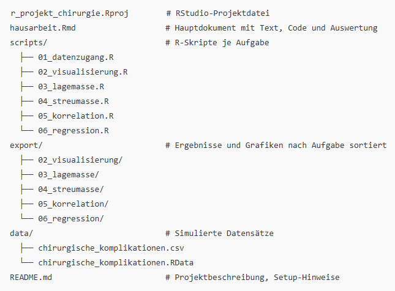

------------------------------------------------------------------------

# Verzeichnisstruktur



------------------------------------------------------------------------

# Vorbereitungen

### 1. Werkzeuge und globale Einstellungen auswählen:

-   Öffne **RStudio**.
-   Klicke in der Menüleiste auf **Tools**.
-   Wähle dann **Global Options** aus dem Dropdown-Menü. Dadurch öffnet sich das Fenster mit den globalen Einstellungen von RStudio.

### 2. Global Settings für R Markdown konfigurieren:

-   Im Fenster der globalen Optionen gehst du zum Abschnitt **R Markdown**.
-   Dort findest du verschiedene Einstellungen, die du nach deinen Bedürfnissen anpassen kannst.

### 3. "Show output inline for all R Markdown documents" deaktivieren:

-   Im Abschnitt **R Markdown** gibt es eine Option mit der Bezeichnung **"Show output inline for all R Markdown documents"**.
-   Entferne den Haken bei dieser Option, um zu verhindern, dass der Output von R Markdown-Dokumenten inline angezeigt wird.

------------------------------------------------------------------------

# Installiere die packages damit der Code funktioniert!

```{r packages_install}
# Liste der zu installierenden Pakete
pakete <- c("renv", "dplyr", "ggbeeswarm", "ggplot2", "gridExtra", "here", "reshape2", "rmarkdown", "stargazer", "renv")

# Schleife, um jedes Paket zu installieren
installiere_pakete <- function(pakete) {
  for (paket in pakete) {
    # Überprüfen, ob das Paket bereits installiert ist
    if (!requireNamespace(paket, quietly = TRUE)) {
      # Installiere das Paket, falls es nicht installiert ist
      install.packages(paket)
      cat(paste("Das Paket", paket, "wurde erfolgreich installiert.\n"))
    } else {
      # Paket ist bereits installiert
      cat(paste("Das Paket", paket, "ist bereits installiert und geladen.\n"))
    }
  }
}

# Installiere die Pakete
installiere_pakete(pakete)

# Optional: Zeige eine Nachricht, dass alle Pakete installiert wurden
cat("Alle Pakete wurden überprüft und installiert (falls notwendig).\n")
```

## Projekt wiederherstellen, damit werden alle Umgebungen genau so hergestellt, wie ich es programmiert habe (wichtig!)

```{r packages_install}
renv::restore()
```

------------------------------------------------------------------------

# Aufgabe a) Bedeutung der Daten im Studienkontext

## Statistische Begriffe im Projektkontext

-   **Merkmalsträger:** Ein einzelner chirurgischer Eingriff
-   **Merkmale:**
    -   *Operationsdauer* (in Minuten)
    -   *Blutverlust* (in Millilitern)
    -   *Komplikationsrisiko* (Skalenwert zwischen 30–300)
-   **Merkmalsausprägung:** Ein konkreter Wert pro Merkmal, z. B. 120 Minuten, 180 ml, Risikoindex 210
-   **Skalenniveau:** Alle drei Merkmale sind **metrisch skaliert**. Daher sind statistische Berechnungen wie Mittelwert, Varianz oder Regressionsanalyse sinnvoll.
-   **Hinweis zur Skala Komplikationsrisiko:**\
    Der Wert "Komplikationsrisiko" ist ein **Indexwert** zur besseren Vergleichbarkeit. Er soll *nicht* als realer Prozentwert interpretiert werden, sondern stellt ein relatives Maß zur Einschätzung des Risikos dar. So kann z. B. "180" als doppelt so risikobehaftet wie "90" betrachtet werden.

------------------------------------------------------------------------

# Datenerzeugung mit R

Zu Beginn der Analyse wird ein Datensatz mit 500 simulierten Beobachtungen erzeugt. Jede dieser Beobachtungen repräsentiert einen chirurgischen Eingriff, und der Datensatz umfasst die Variablen *Operationsdauer*, *Blutverlust* und *Komplikationsrisiko*, die zufällig im Bereich von 30 bis 300 erzeugt wurden. Diese Auswahl stellt sicher, dass alle Variablen denselben Wertebereich abdecken, was eine vergleichbare Analyse ermöglicht.

### Code-Erklärung:

```{r datensatz_erzeugen}
source(here::here("scripts", "01_datenerzeugung_v2.R"))
```

-   **`source()`**: Mit dieser Funktion wird das R-Skript `01_datenerzeugung.R` aufgerufen, das die Datenerstellung übernimmt. Das Skript erzeugt drei Zufallsvariablen:
    -   **`Operationsdauer`**: Zufallszahlen im Bereich von 30 bis 300, die die Dauer der Operation in Minuten repräsentieren.
    -   **`Blutverlust`**: Zufallszahlen im selben Bereich, die den Blutverlust in Millilitern beschreiben.
    -   **`Komplikationsrisiko`**: Ein weiteres zufällig generiertes Maß für das Risiko von Komplikationen, ebenfalls im Bereich von 30 bis 300.
-   **Speicherung der Daten**: Die erzeugten Daten werden sowohl in der `.RData`- als auch in der `.csv`-Datei gespeichert, um die Weiterverwendung zu erleichtern.

------------------------------------------------------------------------

# Aufgabe b) Grafische Darstellung

Um die Verteilung der Variablen visuell darzustellen, werden verschiedene Diagrammtypen verwendet. Insbesondere werden Histogramme und Beeswarm-Plots eingesetzt, um die Häufigkeit der Daten sowie die Verteilung innerhalb der Variablen darzustellen.

### Code-Erklärung:

```{r visualisierung}
source(here::here("scripts", "02_visualisierung_v4.R"))
```

-   **`source()`**: Hier wird das Skript `02_visualisierung.R` aufgerufen, das für die grafische Darstellung verantwortlich ist.

------------------------------------------------------------------------

# Aufgabe c) Lagemaße

In dieser Aufgabe werden die Lagemaße (Mittelwert, Median und Modus) für jede Variable berechnet. Lagemaße beschreiben die zentrale Tendenz einer Verteilung und helfen, den "typischen" Wert einer Variablen zu bestimmen.

### Code-Erklärung:

```{r lagemasse}
source(here::here("scripts", "03_lagemasse_v5.R"))
```

-   **`source()`**: Das Skript `03_lagemasse.R` wird hier aufgerufen, um die Berechnungen der Lagemaße durchzuführen.

------------------------------------------------------------------------

# Aufgabe d) Streumaße

Streumaße wie die Standardabweichung, der Interquartilsabstand (IQR) und die mittlere absolute Abweichung (MAD) messen, wie weit die Daten von der zentralen Tendenz entfernt sind. Diese Maße geben Aufschluss darüber, wie variabel oder stabil die Werte innerhalb einer Variablen sind.

### Code-Erklärung:

```{r streumasse}
source(here::here("scripts", "04_streumasse_v5.R"))
```

-   **`source()`**: Das Skript `04_streumasse.R` wird verwendet, um die Streumaße zu berechnen und darzustellen.

------------------------------------------------------------------------

# Aufgabe e) Korrelationen

Korrelationen beschreiben die Beziehung zwischen zwei Variablen. Ein positiver Korrelationskoeffizient zeigt an, dass ein Anstieg einer Variablen mit einem Anstieg der anderen Variablen verbunden ist.

### Code-Erklärung:

```{r korrelation}
source(here::here("scripts", "05_korrelation_v5.R"))
```

-   **`source()`**: Das Skript `05_korrelation.R` wird aufgerufen, um die Korrelationen zwischen den Variablen zu berechnen und darzustellen.

------------------------------------------------------------------------

# Aufgabe f) Regressionsanalyse

Die Regressionsanalyse wird verwendet, um die Beziehung zwischen einer abhängigen und einer oder mehreren unabhängigen Variablen zu modellieren. In dieser Aufgabe wird untersucht, ob das Komplikationsrisiko durch den Blutverlust und die Operationsdauer vorhergesagt werden kann.

### Code-Erklärung:

```{r regression}
source(here::here("scripts", "06_regression_v5.R"))
```

-   **`source()`**: Das Skript `06_regression.R` wird aufgerufen, um die Regressionsanalyse durchzuführen.

------------------------------------------------------------------------
